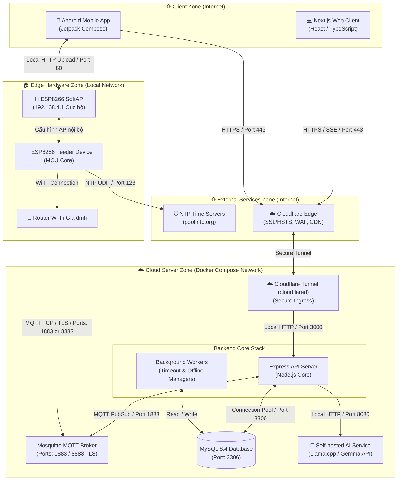

# Hệ sinh thái PawFeed IoT - Danh sách Repositories

Tài liệu này ánh xạ toàn bộ các kho lưu trữ (repositories) cấu thành nên **Hệ sinh thái PawFeed IoT**. Nhấn vào các đường dẫn bên dưới để chuyển hướng đến từng thành phần tương ứng.

---

# [PawFeed_Web](https://github.com/PhongDayNai/PawFeed_Web)

[](https://nextjs.org/)
[](https://react.dev/)
[](https://www.typescriptlang.org/)
[](https://github.com/css-modules/css-modules)

Bảng điều khiển khách (client dashboard) ứng dụng Web Next.js responsive dành cho **Hệ sinh thái PawFeed IoT**. Được xây dựng bằng React, TypeScript và Vanilla CSS Modules, đây là trung tâm điều khiển chính để người nuôi thú cưng kết nối và quản lý máy cho ăn, theo dõi số liệu chẩn đoán phần cứng theo thời gian thực, thiết lập lịch trình cho ăn offline, gửi lệnh điều khiển từ xa và tương tác trực tiếp với **Trợ lý ảo AI Nomi**.

## 🚀 Các chức năng cốt lõi của Web Client

### 1. Quản lý Tài khoản & Xác thực Đồng bộ
- **JWT Authorization**: Lưu trữ an toàn Access & Refresh Token trong Local Storage. Sử dụng hàng đợi request thread-safe để tự động xoay vòng token khi nhận phản hồi `401 Unauthorized` từ API.
- **Cập nhật Thông tin**: Giao diện cho phép người dùng thay đổi họ tên hiển thị và cập nhật mật khẩu tài khoản kèm theo các bước kiểm tra xác thực.
- **Điều hướng Bảo vệ (Route Guards)**: Tự động chuyển hướng người dùng đã đăng nhập vào Bảng điều khiển và chặn các trang nội bộ đối với khách vãng lai, đưa họ về trang đăng nhập/đăng ký.

### 2. Bảng điều khiển Trung tâm Trực quan (Dashboard)
- **Chỉ số Tổng quan**: Hiển thị tổng số lượng thiết bị, số máy đang online, offline và tổng số lượt cho ăn trong ngày thông qua các thẻ thống kê trực quan.
- **Hiệu ứng Morphing Grid (Micro-Animations)**: Khi cuộn trang trên màn hình máy tính hoặc máy tính bảng, hệ thống tự tính toán tỷ lệ cuộn để thu hẹp Grid từ bố cục `2x2` thành thanh ngang `1x4` gọn gàng, giúp tối ưu hóa không gian hiển thị.
- **Danh sách Nhanh**: Cung cấp lối tắt truy cập nhanh các thiết bị hoạt động gần đây, trạng thái kết nối trực tuyến và tóm tắt lịch sử bữa ăn mới nhất.

### 3. Xem Chi tiết & Chẩn đoán Thiết bị
- **Bảng số liệu thời gian thực**: Hiển thị chi tiết tình trạng kết nối MQTT Broker, cường độ sóng Wi-Fi (RSSI), địa chỉ IP nội mạng, thời gian hoạt động liên tục (uptime) của vi điều khiển, bộ nhớ Heap tự do, phiên bản firmware và trạng thái đóng/mở của cửa nhả hạt.
- **Cấu hình WiFi qua SoftAP cục bộ**: Cho phép người dùng nhập thông tin mạng Wi-Fi mới và tải xuống file cấu hình JSON đã được ký mã hóa bằng chữ ký số HMAC-SHA256 từ server. Người dùng chỉ cần kết nối vào SoftAP của thiết bị (`192.168.4.1`) và nạp file này để thay đổi mạng Wi-Fi cho thiết bị một cách an toàn.
- **Tác vụ Thiết bị**: Đổi tên hiển thị thiết bị hoặc thực hiện hủy liên kết thiết bị ra khỏi tài khoản người dùng một cách an toàn.

### 4. Cho ăn Từ xa ("Feed Now" tích hợp Idempotency)
- **Thanh trượt chính xác**: Chọn thời gian nhả hạt linh hoạt từ 100ms lên đến 10 giây.
- **Chống trùng lặp lệnh (Idempotent)**: Tự động sinh mã UUID duy nhất và đính kèm vào header `Idempotency-Key` của request nhằm ngăn chặn việc thiết bị nhả hạt hai lần do người dùng nhấn nút liên tục hoặc khi kết nối mạng chập chờn.
- **Tiến trình & Đếm ngược**: Lắng nghe sự kiện phản hồi để hiển thị đồng hồ đếm ngược và trạng thái thực thi lệnh theo thời gian thực (đang gửi, đang nhả hạt, thành công, thất bại).

### 5. Lập Lịch tự động (Cơ chế Chống Xung đột ETag)
- **Kế hoạch ăn tự động**: Hỗ trợ thiết lập tối đa 8 khung giờ ăn tự động trong ngày cho mỗi thiết bị (cấu hình mốc thời gian, thời gian nhả hạt, các ngày lặp lại trong tuần và trạng thái bật/tắt).
- **Chặn xung đột phiên bản**: Sử dụng cơ chế Optimistic Concurrency Control qua header `If-Match` chứa ETag do server cấp. Nếu dữ liệu lịch trình trên máy chủ đã bị thay đổi bởi ứng dụng khác (ví dụ: Mobile App) kể từ lúc trang web được tải, hệ thống sẽ đưa ra cảnh báo và ngăn chặn việc ghi đè dữ liệu cũ.

### 6. Luồng Sự kiện SSE & Tự động Phục hồi Kết nối
- **Luồng nhận tin thời gian thực**: Thiết lập kết nối Server-Sent Events (SSE) đến đường dẫn `/events/stream`, sử dụng Stream Reader để đọc từng đoạn dữ liệu HTTP.
- **Cập nhật giao diện lập tức**: Nhận các sự kiện từ server (`device_status_updated`, `feeding_completed`, `config_applied`) để hiển thị thông báo toast tức thời và tự động cập nhật lại dữ liệu thiết bị mà không cần tải lại toàn bộ trang web.
- **Exponential Backoff**: Tự động thử kết nối lại với độ trễ tăng dần nếu mạng bị ngắt quãng hoặc phiên đăng nhập hết hạn.

### 7. Bong bóng Trợ lý ảo Nomi AI
- **Giao diện nổi tiện lợi**: Cửa sổ chat của trợ lý ảo Nomi được tích hợp ở góc màn hình, có thể mở nhanh từ bất kỳ trang nào.
- **Streaming phản hồi trực tiếp**: Sử dụng cơ chế đọc stream SSE để hiển thị câu trả lời dạng chữ chạy theo thời gian thực, tạo cảm giác tự nhiên như đang trò chuyện trực tiếp.
- **Gọi hàm tương tác (Interactive Tool Calling)**: Khi Nomi phát hiện yêu cầu hành động vật lý từ người dùng, server sẽ tạm dừng phản hồi và trả về cấu trúc `tool_calls` (`proposeFeedNow` hoặc `proposeSaveSchedule`). Web Client sẽ chặn sự kiện này để vẽ một **Thẻ Xác nhận Hành động** trên khung chat. Lệnh vật lý thực tế chỉ được thực thi khi người dùng bấm nút "Phê duyệt".
- **Lịch sử & Quản lý Hội thoại**: Hỗ trợ làm mới hội thoại (lưu trữ phiên chat cũ lên server) và cuộn trang để tải lại lịch sử tin nhắn phân trang.

## 🛠️ Công nghệ Sử dụng

- **Framework**: Next.js v16.2.7 (App Router, Node.js API Routes Proxy)
- **Thư viện cốt lõi**: React v19.2.4 & TypeScript v5
- **Styling**: Vanilla CSS Modules (sử dụng hệ thống CSS variables hỗ trợ giao diện Sáng/Tối - Light/Dark Mode)
- **Icons**: Lucide React v1.17.0
- **Công cụ kiểm thử & build**: ESLint v9, PostCSS
- **Triển khai**: Dockerfile multi-stage & Docker Compose

## 📂 Cấu trúc Thư mục

```text
paw-feed-web/
├── Dockerfile              # Build production qua nhiều giai đoạn (deps -> builder -> runner)
├── docker-compose.yml      # Cấu hình container chạy thử local
├── docs/
│   └── chatbot-api.md      # Đặc tả chi tiết tích hợp API Chatbot Nomi
├── eslint.config.mjs
├── next.config.ts          # Cấu hình rewrite proxy chuyển tiếp API sang Backend (tránh lỗi CORS)
├── package.json            # Khai báo scripts và các thư viện dependencies
├── public/                 # Thư mục chứa tài nguyên tĩnh (favicon, hình ảnh)
└── src/
    ├── app/                # Các routes chính của ứng dụng Next.js (App Router)
    │   ├── Header.tsx      # Navbar điều hướng, chuyển đổi ngôn ngữ và giao diện sáng/tối
    │   ├── Header.module.css
    │   ├── globals.css     # CSS chung toàn app, biến token thiết kế và hoạt họa
    │   ├── layout.tsx      # Bố cục gốc (đăng ký Fonts, Providers, ChatbotBubble)
    │   ├── page.tsx        # Trang trung gian chuyển hướng người dùng (Home Router)
    │   ├── account/        # Trang thiết lập tài khoản và cập nhật mật khẩu
    │   ├── activity/       # Xem nhật ký hoạt động (Lịch sử cho ăn & Sự kiện thiết bị)
    │   ├── api/v1/chatbot/ # Proxy server Next.js xử lý stream SSE cho chatbot
    │   ├── dashboard/      # Trang giao diện chính hiển thị thống kê và danh sách thiết bị
    │   └── devices/        # Danh sách thiết bị, chẩn đoán, lập lịch và cho ăn thủ công
    ├── components/         # Các UI components dùng chung
    │   ├── ChatbotBubble.tsx # Cửa sổ trợ lý ảo Nomi AI chat
    │   ├── PawButton.tsx   # Nút bấm thiết kế riêng theo chủ đề PawFeed
    │   ├── PawCard.tsx     # Khung chứa nội dung thông tin
    │   └── PawSelect.tsx   # Hộp chọn dropdown tùy chỉnh giao diện
    ├── context/            # Tầng quản lý trạng thái React Context
    │   ├── AppContext.tsx  # Quản lý auth, danh sách thiết bị, log và sự kiện SSE
    │   ├── LanguageContext.tsx # Bộ chuyển đổi đa ngôn ngữ Anh/Việt (EN/VI)
    │   └── ThemeContext.tsx    # Bộ điều khiển theme sáng/tối
    └── lib/                # Tiện ích dùng chung
        ├── api.ts          # Bộ SDK kết nối API RESTful và thiết lập stream SSE
        ├── error.ts        # Bộ chuyển đổi mã lỗi hệ thống sang câu thông báo dễ hiểu
        ├── locales.json    # File chứa toàn bộ chuỗi ngôn ngữ EN/VI
        └── types.ts        # Khai báo các TypeScript interfaces của models và API responses
```

## 🔌 Kiến trúc Hệ thống & Luồng Dữ liệu

Dưới đây là mô hình kiến trúc hạ tầng và giao tiếp của toàn bộ hệ sinh thái PawFeed, mô tả vai trò kết nối của Web Client:



## ⚡ Cài đặt & Chạy Thử cục bộ

### 1. Yêu cầu Hệ thống
Đảm bảo máy tính của bạn đã cài đặt các công cụ sau:
- **Node.js** (phiên bản >= 20.0.0)
- **npm** (phiên bản >= 10.0.0)

### 2. Thiết lập Ban đầu
Tải mã nguồn về máy, di chuyển vào thư mục dự án và cài đặt các dependencies:
```bash
npm install
```

Tạo file môi trường cấu hình cục bộ từ file mẫu:
```bash
cp .env.example .env
```

### 3. Cấu hình Biến Môi trường
Mở file `.env` vừa tạo và điền các thông số:
```text
# Path API ở Client (Sử dụng đường dẫn tương đối /api/v1 để proxy qua Next.js tránh lỗi CORS)
NEXT_PUBLIC_API_URL=/api/v1

# Endpoint của Backend thực tế (Được Next.js sử dụng ở phía Server để chuyển tiếp request)
BACKEND_API_URL=http://localhost:3000/v1
```
*Lưu ý: Việc chạy proxy qua tính năng rewrites của Next.js giúp giải quyết triệt để lỗi chặn CORS ở trình duyệt mà không cần khai báo headers phức tạp ở production server.*

### 4. Khởi chạy Server Phát triển (Development)
Chạy ứng dụng Next.js cục bộ:
```bash
npm run dev
```
Truy cập địa chỉ [http://localhost:8870](http://localhost:8870) (hoặc cổng được hiển thị trên terminal của bạn) để bắt đầu sử dụng.

### 5. Kiểm tra chất lượng & Build Production
Trước khi đưa lên production, hãy chạy các script kiểm tra và build:
```bash
# Kiểm tra lỗi cú pháp và linter
npm run lint

# Build mã nguồn thành bản phân phối tối ưu
npm run build

# Chạy bản build production ngay trên máy cục bộ
npm run start
```

## 🐳 Triển khai bằng Docker Compose

Ứng dụng Web Client có thể được đóng gói và chạy tự động thông qua container:

1. Thiết lập các cấu hình môi trường trong file `.env` (đảm bảo `BACKEND_API_URL` trỏ đến đúng máy chủ Express đang chạy).
2. Khởi động container:
   ```bash
   docker compose up -d --build
   ```
3. Web Client sẽ lắng nghe tại cổng `http://localhost:8870`.
4. Dừng và dọn dẹp container:
   ```bash
   docker compose down
   ```

## 🤖 Tích hợp Trợ lý ảo Nomi AI & Đề xuất Hành động

Bong bóng chat sử dụng giao thức Server-Sent Events (SSE) để tải phản hồi trực tiếp. Khi mô hình AI muốn thực hiện các lệnh vật lý, máy chủ backend sẽ tạm dừng và trả về mã định danh interactive tool. Client sẽ nhận diện sự kiện này để hiển thị thẻ giao diện phê duyệt:

1. **`proposeFeedNow`**: Nhận `deviceId` và `openDurationMs`, hiển thị thẻ xác nhận trên chat: *"Bạn có đồng ý cho bé Milo ăn 20g hạt (3 giây) ngay bây giờ không?"*. Khi người dùng nhấn **Xác nhận**, Client sẽ gọi API:
   ```http
   POST /v1/devices/:deviceId/commands/feed-now
   Content-Type: application/json
   Idempotency-Key: <uuid>
   
   { "openDurationMs": 3000 }
   ```
2. **`proposeSaveSchedule`**: Nhận danh sách lịch trình, hiển thị các khung giờ ăn đề xuất kèm theo nút phê duyệt. Khi người dùng nhấn **Xác nhận**, Client thực hiện gọi API:
   ```http
   PUT /v1/devices/:deviceId/schedule
   Content-Type: application/json
   
   { "entries": [{ "time": "08:00", "openDurationMs": 2000 }] }
   ```

## 📜 Danh sách các Routes chính trên Web Client

Dưới đây là sơ đồ định tuyến trang chính trong ứng dụng:

| Đường dẫn (Route) | Quyền truy cập | Hook quản lý Context | Mô tả chức năng |
| :--- | :---: | :---: | :--- |
| `/login` | Public | Auth Context | Đăng nhập tài khoản, nhận token JWT |
| `/register` | Public | Auth Context | Đăng ký tài khoản người dùng mới |
| `/dashboard` | User | App Context | Chỉ số tổng quan, truy cập nhanh thiết bị và lịch sử |
| `/devices` | User | App Context | Tìm kiếm, lọc và xem danh sách các máy cho ăn đã liên kết |
| `/devices/:id` | User | App Context | Xem chi tiết chẩn đoán phần cứng, đổi tên và hủy liên kết |
| `/devices/:id/feed` | User | App Context | Trình điều khiển cho ăn từ xa theo thời gian thực (đếm ngược trực quan) |
| `/devices/:id/schedule` | User | App Context | Lập lịch ăn tự động (Hỗ trợ chống ghi đè xung đột ETag) |
| `/activity` | User | App Context | Xem nhật ký lịch sử cho ăn và lịch sử sự kiện hệ thống chi tiết |
| `/account` | User | Auth Context | Cập nhật họ tên, thay đổi mật khẩu đăng nhập |

---

# [PawFeed_Server](https://github.com/PhongDayNai/PawFeed_Server)

Máy chủ API chính, tiến trình chạy nền workers và MQTT message brokers.

- **Đường dẫn Repository**: [https://github.com/PhongDayNai/PawFeed_Server](https://github.com/PhongDayNai/PhongDayNai/PawFeed_Server)
- **Chi tiết**: Vui lòng truy cập repository Server để xem hướng dẫn cấu hình cơ sở dữ liệu, đặc tả API và triển khai hạ tầng.

---

# [PawFeed_App](https://github.com/PhongDayNai/PawFeed_App)

Ứng dụng di động chạy hệ điều hành Android phát triển bằng Jetpack Compose.

- **Đường dẫn Repository**: [https://github.com/PhongDayNai/PawFeed_App](https://github.com/PhongDayNai/PawFeed_App)
- **Chi tiết**: Vui lòng truy cập repository App để xem cách cấu hình SoftAP và mã nguồn di động.

---

# [PawFeed_Firmware (main.cpp)](https://github.com/PhongDayNai/PawFeed_Server/blob/main/machine/main.cpp)

Mã nguồn firmware chạy trên vi điều khiển ESP8266 của máy cho ăn.

- **Đường dẫn File**: [https://github.com/PhongDayNai/PawFeed_Server/blob/main/machine/main.cpp](https://github.com/PhongDayNai/PawFeed_Server/blob/main/machine/main.cpp)
- **Chi tiết**: Được lưu trữ trong thư mục `machine/` của Server. Quản lý hoạt động quay motor, đồng bộ thời gian NTP và các lệnh MQTT.
