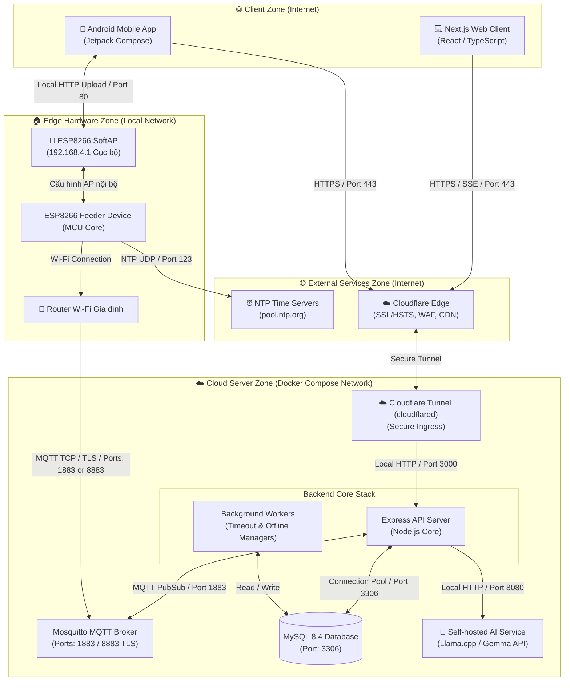

# PawFeed IoT Ecosystem - Repositories

This document maps all the repositories that form the **PawFeed IoT Ecosystem**. Click on the links below to navigate to each component.

---

# [PawFeed_Web](https://github.com/PhongDayNai/PawFeed_Web)

[](https://nextjs.org/)
[](https://react.dev/)
[](https://www.typescriptlang.org/)
[](https://github.com/css-modules/css-modules)

The responsive Next.js web application client dashboard for the **PawFeed IoT Ecosystem**. Built with React, TypeScript, and Vanilla CSS Modules, it serves as the central control panel for pet owners to register and manage smart feeders, monitor hardware telemetry in real time, set up offline feeding schedules, dispatch remote commands, and chat with the **Nomi AI Assistant**.

**Live Production Web Dashboard**: [https://pawfeed.phongdaynai.id.vn/](https://pawfeed.phongdaynai.id.vn/)

## 🚀 Key Features of Web Client

### 1. Unified Authentication & Profile Management
- **JWT Authorization**: Safely stores Access & Refresh tokens in local storage. Employs a thread-safe request queue to coordinate token rotation on `401 Unauthorized` API responses.
- **Profile Customization**: Interface to modify user full name and securely update accounts passwords with validation checks.
- **Auto-Routing Guards**: Integrated page protection redirects authenticated users to the Dashboard while routing guests back to login/registration routes.

### 2. Interactive Centralized Dashboard
- **Telemetry Indicators**: Displays total, online, offline device counts and cumulative feeding logs in high-contrast summary cards.
- **Micro-Animations (Dynamic Grid)**: When scrolling on desktop/tablet views, a custom scroll-progress tracker smoothly transitions the summary grid from a `2x2` grid layout to a compact `1x4` horizontal bar, saving vertical viewport space.
- **Activity & Device Highlights**: Provides direct access to recently active devices, connection status badges, and recent feeding log summaries.

### 3. Detailed Device Diagnostics & Lifecycle
- **Real-Time Telemetry Panels**: Visualizes connection details (MQTT broker link state, Wi-Fi RSSI strength, local IP address), MCU uptime, free heap memory, firmware version, and physical feeder door states.
- **Secure SoftAP Configuration**: Allows users to enter new local Wi-Fi credentials and downloads an authenticated JSON configuration file. The file is cryptographically signed with HMAC-SHA256 from the server, ready to be uploaded locally onto the device's SoftAP server (`192.168.4.1`) to update Wi-Fi without risking firmware inputs.
- **Device Operations**: Edit device display names or safely unlink devices from the user account.

### 4. Remote Feeding ("Feed Now" with Idempotency)
- **Precision Slider**: Adjust feed dispensing time from 100ms up to 10 seconds.
- **Idempotent Dispatch**: Automatically generates and attaches a unique UUID (`Idempotency-Key`) in the headers to prevent duplicate physical feedings if the user clicks the action button repeatedly or during unstable network connectivity.
- **Real-time Progress & Countdown**: Uses active connection listeners to show a visual countdown and dispatch feedback status (sending, dispensing, completed, failed).

### 5. Automatic Feeding Schedules (Optimistic Concurrency Control)
- **Schedule Planner**: Supports creating up to 8 custom daily feeding entries per device (specifying time, motor duration, repeating days of the week, and active status).
- **Collision Guard (ETag Sync)**: Utilizes `If-Match` headers with server-generated ETags. If the schedule was edited elsewhere (e.g. from the mobile app) since the user loaded the page, it prompts a version collision warning and prevents overwriting changes.

### 6. Server-Sent Events (SSE) Sync & Network Recovery
- **Real-Time Ingress stream**: Establishes a persistent SSE stream (`/events/stream`) using chunk-by-chunk HTTP stream readers to process real-time updates.
- **Instant UI Reactivity**: Broadcasts incoming events (`device_status_updated`, `feeding_completed`, `config_applied`) directly to the active screen. Triggering instant toast notifications and silent database refreshes without needing manual page reloads.
- **Exponential Backoff**: Automatically reconnects with gradual delay scaling if the network drops or user authentication expires.

### 7. Floating Nomi AI Assistant Chatbot
- **Responsive Floating Interface**: Interactive chat panel accessible on any page of the web application.
- **Real-time SSE Streaming**: Employs streaming HTTP readers to parse incoming responses chunk-by-chunk, drawing words onto the chat box instantly.
- **Interactive Tool Calling**: When Nomi proposes a physical action, the chatbot parses the `tool_calls` payload (`proposeFeedNow` or `proposeSaveSchedule`), pauses the conversation, and renders a **UI Approval Card**. The client executes the actual physical API call only after the user clicks "Approve".
- **Archiving & Session Management**: Supports restarting conversations (archiving old logs on the server) and loading historical messages with paginated scroll.

## 🛠️ Technology Stack

- **Framework**: Next.js v16.2.7 (App Router, Node.js API Routes Proxy)
- **Core Library**: React v19.2.4 & TypeScript v5
- **Styling**: Vanilla CSS Modules (featuring custom variables for Dark/Light mode theme system)
- **Icons**: Lucide React v1.17.0
- **Build & Dev Tools**: ESLint v9, PostCSS
- **Containerization**: Multi-stage Dockerfile & Docker Compose

## 📂 Project Structure

```text
paw-feed-web/
├── Dockerfile              # Multi-stage production build (deps -> builder -> runner)
├── docker-compose.yml      # Local multi-container development orchestration
├── docs/
│   └── chatbot-api.md      # Detailed Nomi chatbot integration specifications
├── eslint.config.mjs
├── next.config.ts          # Rewrites configuration for backend proxying (CORS bypass)
├── package.json            # Scripts & dependencies definitions
├── public/                 # Static assets (favicons, images)
└── src/
    ├── app/                # Next.js App Router folders
    │   ├── Header.tsx      # Navigation navbar, theme toggles, and language switcher
    │   ├── Header.module.css
    │   ├── globals.css     # Global styles, variables, typography, and scroll behaviors
    │   ├── layout.tsx      # Root layout injection (Fonts, Providers, ChatbotBubble)
    │   ├── page.tsx        # Entry redirect page (Home Router)
    │   ├── account/        # User profile and password updating page
    │   ├── activity/       # Aggregated logs (Feeding History & Device Events)
    │   ├── api/v1/chatbot/ # Server-side API Route proxy handling SSE streaming
    │   ├── dashboard/      # Primary statistics and device lists view
    │   └── devices/        # Feeder listings, detail diagnostics, scheduling, and feed screens
    ├── components/         # Reusable UI component modules
    │   ├── ChatbotBubble.tsx # Floating Nomi AI chat drawer
    │   ├── PawButton.tsx   # Curated action button
    │   ├── PawCard.tsx     # Stylized content container
    │   └── PawSelect.tsx   # Custom themed drop-down select component
    ├── context/            # React Context state layers
    │   ├── AppContext.tsx  # Central state: authentication, devices, logs, and SSE events
    │   ├── LanguageContext.tsx # Song ngữ localization (EN/VI) controller
    │   └── ThemeContext.tsx    # Light/Dark mode state controller
    └── lib/                # Shared utilities & configurations
        ├── api.ts          # Core API SDK client (auth, devices, schedules, SSE)
        ├── error.ts        # Friendly translations mapper for network/server errors
        ├── locales.json    # JSON translation catalog for EN/VI locales
        └── types.ts        # TypeScript interface declarations for models & responses
```

## 🔌 System Architecture & Data Flow

Below is the deployment and network architecture of the entire ecosystem, showing how the Web client interacts with the servers:



## ⚡ Setup & Local Development

### 1. Requirements
Ensure you have the following installed locally:
- **Node.js** (version >= 20.0.0)
- **npm** (version >= 10.0.0)

### 2. Initial Setup
Clone the repository, navigate into the directory, and install the package dependencies:
```bash
npm install
```

Create your local environment configuration file:
```bash
cp .env.example .env
```

### 3. Environment Configuration
Open the `.env` file and set the variables:
```text
# Client-side API URL path (use relative path /api/v1 to proxy via Next.js and bypass CORS)
NEXT_PUBLIC_API_URL=/api/v1

# Backend API Endpoint URL (used on Next.js server-side to rewrite and proxy requests)
BACKEND_API_URL=http://localhost:3000/v1
```
*Note: Proxying through Next.js rewrite rules resolves CORS errors without needing headers alterations on the production server.*

### 4. Running the Development Server
Run the local Next.js server:
```bash
npm run dev
```
Open [http://localhost:8870](http://localhost:8870) (or the port defined in your terminal) to access the dashboard.

### 5. Code Validation & Production Build
Ensure the application code compiles correctly and follows style standards:
```bash
# Lint the codebase
npm run lint

# Build the production bundle
npm run build

# Start the built production app locally
npm run start
```

## 🐳 Docker Compose Deployment

The web client can be built and served inside a container for easy deployment:

1. Configure the environment variables in `.env` (ensuring `BACKEND_API_URL` points to the reachable Express server).
2. Start the container:
   ```bash
   docker compose up -d --build
   ```
3. The server will launch and listen on `http://localhost:8870`.
4. Tear down the container:
   ```bash
   docker compose down
   ```

## 🤖 Nomi AI Assistant & Function Calling Integration

The floating chatbot uses standard Server-Sent Events (SSE) to render streams. When Nomi detects a request for device interactions, the backend pauses the thread and issues a tool call. The client intercepts these and renders a custom widget card:

1. **`proposeFeedNow`**: Extracts the target `deviceId` and `openDurationMs`, drawing a prompt Card: *"Would you like to feed Milo 20g (3s) now?"*. Clicking **Confirm** triggers:
   ```http
   POST /v1/devices/:deviceId/commands/feed-now
   Content-Type: application/json
   Idempotency-Key: <uuid>
   
   { "openDurationMs": 3000 }
   ```
2. **`proposeSaveSchedule`**: Extracts the schedule array, rendering a confirmation card displaying times and durations. Clicking **Confirm** fires:
   ```http
   PUT /v1/devices/:deviceId/schedule
   Content-Type: application/json
   
   { "entries": [{ "time": "08:00", "openDurationMs": 2000 }] }
   ```

## 📜 Route & Interface Catalog

The web client contains the following primary page routes:

| Route Path | Access | Context Hook | Description |
| :--- | :---: | :---: | :--- |
| `/login` | Public | Auth Context | Authenticate user, issues JWTs |
| `/register` | Public | Auth Context | Register new account |
| `/dashboard` | User | App Context | General stats, quick details, active feeders |
| `/devices` | User | App Context | Searchable lists of all owned devices |
| `/devices/:id` | User | App Context | Hardware diagnostics status, unlinking & configuration actions |
| `/devices/:id/feed` | User | App Context | Interactive remote motor feed dispatcher with countdowns |
| `/devices/:id/schedule` | User | App Context | Timezone aware feeding schedule planner (Collision Guarded) |
| `/activity` | User | App Context | Tabbed logs of historical meals and detailed device heartbeats |
| `/account` | User | Auth Context | Update name, change account passwords |

---

# [PawFeed_Server](https://github.com/PhongDayNai/PawFeed_Server)

The core API backend server, background workers, and MQTT handlers.

- **Repository Link**: [https://github.com/PhongDayNai/PawFeed_Server](https://github.com/PhongDayNai/PawFeed_Server)
- **Details**: Refer to the Server repository for deployment setups, databases schemas, and API documentation.

---

# [PawFeed_App](https://github.com/PhongDayNai/PawFeed_App)

The Jetpack Compose Android client application.

- **Repository Link**: [https://github.com/PhongDayNai/PawFeed_App](https://github.com/PhongDayNai/PawFeed_App)
- **Details**: Refer to the Mobile App repository for mobile native logic and SoftAP upload scripts.

---

# [PawFeed_Firmware (main.cpp)](https://github.com/PhongDayNai/PawFeed_Server/blob/main/machine/main.cpp)

The C++/Arduino firmware running on the ESP8266 controller.

- **File Link**: [https://github.com/PhongDayNai/PawFeed_Server/blob/main/machine/main.cpp](https://github.com/PhongDayNai/PawFeed_Server/blob/main/machine/main.cpp)
- **Details**: Built inside the server repository under the `machine/` path. Handles motor timing, SoftAP local provisioning server, and MQTT commands.
